

 

 
<h1> BizCard : 모바일 명함관리 MS Teams 앱 <h1/>

## 목차

- [목차](#목차)
- [프로젝트 개요](#프로젝트-개요)
  - [프로젝트 기간](#프로젝트-기간)
- [팀원 소개](#팀원-소개)
  - [기획의도](#기획의도)
  - [목표](#목표)
- [서비스 기능 소개](#서비스-기능-소개)
- [🛠️ 기술 스택](#️-기술-스택)
  - [Frontend](#frontend)
  - [Backend](#backend)
  - [DB](#db)
  - [Infra](#infra)
  - [Tools](#tools)
- [프로젝트 구성](#프로젝트-구성)
  - [**아키텍쳐**](#아키텍쳐)
  - [**ERD**](#erd)
  - [**API 명세서**](#api-명세서)
  - [**와이어프레임**](#와이어프레임)
- [기대효과](#기대효과)
- [차별점](#차별점)
- [화면](#화면)
- [실행 방법 / 포팅 메뉴얼](#실행-방법--포팅-메뉴얼)

## 프로젝트 개요

 

 
 
삼성 청년 SW 아카데미(SSAFY) - 포스코인터내셔널 기업연계 프로젝트

`MS Teams` `명함` `공유`

### 프로젝트 기간

2024.04.08 ~ 2024.05.17

2024.05.10 포스코인터내셔널 완료 보고회

2024.05.20 삼성 청년 SW 아카데미 최종 발표

## 팀원 소개

|  |  |  |  |  |  |
| :-------------------: | :-------------------: | :-------------------: | :-------------------: | :-------------------: | :-------------------: |
|      **김태훈**       |      **강대수**       |      **정준원**       |      **김민주**       |      **이승호**       |      **유병욱**       |
|  팀장   Backend   |        Backend        |        Backend        |       Frontend        |       Frontend        |       Frontend        |

### 기획의도

포스코인터내셔널의 명세를 기반으로 다음과 같은 의도로 기획되었습니다.

- 실물 명함의 저장 필요성
- 화상 회의 또는 채팅 상황의 명함 공유의 필요성
- 실물 명함이 없는 경우의 대체 사용 가능한 명함의 필요성

### 목표

    임직원간 외부앱을 통한 번거로운  명함 공유를 MS Teams 내부 앱을 통해서 쉽고 빠르게 할 수 있게 하는 것

## 서비스 기능 소개

본 프로젝트는 MS Teams 내부에 설치하는 앱으로 MS Teams 내에서 PC 환경 뿐 아니라 모바일 환경에서도 명함과 관련된 다양한 기능을 제공합니다.

---

**1️⃣ 디지털 명함**

_사내 사용자에게만 제공되는 기능_  
신입사원, 외부인력, 명함 디자인을 정하지 못하신 분들도 디지털 명함을 통해 손쉽게 명함을 공유할 수 있습니다.

실물 명함을 사진으로 등록한 경우에도 디지털 명함이 생성됩니다.

|  | 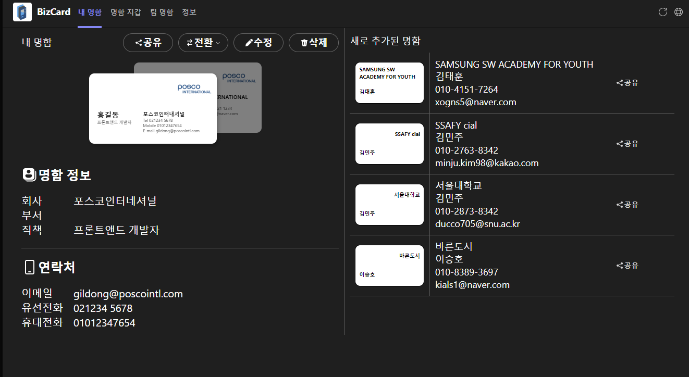  |
| ---------------------------------------------------------------------------------------------------------------------------------------------------------------------------------------------------------------------------------------------------------------------------------------------------------------------------------------------------------------------------------------------------------------------------------------------------------------------------------------------------------------------------------------------------------------------------------------------------------------------------------------------------------------------------------------------------------------------------------------------------------------------------------------------------------------------------------------------------------------------------------------------- | ---------------------------------------- |

**2️⃣ 실물 명함의 OCR을 통한 등록**

OCR을 통해 자신의 명함을 빠르게 등록할 수 있습니다.  
 촬영된 명함의 사진은 {수정필요} 를 통해 깔끔한 명함 이미지로 저장됩니다.

_임직원의 경우 개인의 명함 정보를 바탕으로 디지털 명함이 생성됩니다._

---

**3️⃣ 이메일을 통한 명함 공유**

| 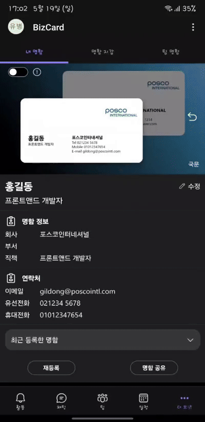 |  |
| ---------------------------------------------------------------------------------------------------------------------------------------------------------------------------------------------------------------------------------------------------------------------------------------------------------------------------------------------------------------------------------------------------------------------------------------------------------------------------------------------------------------------------------------------------------------------------------------------------------------------------------------------------------------------------------------------------------------------------------------------------------------------------------------------------------------------------------------------------------------------------------------------- | --------------------------------------------------------- |

공유를 원하는 이메일 주소 입력을 통해 명함 사진 / 디지털 명함과 명함의 정보를 편리하게 전달할 수 있습니다.

**4️⃣ 팀 기능을 통한 팀원간 명함 공유**

팀 명함지갑에서 팀원간 공유한 명함 확인

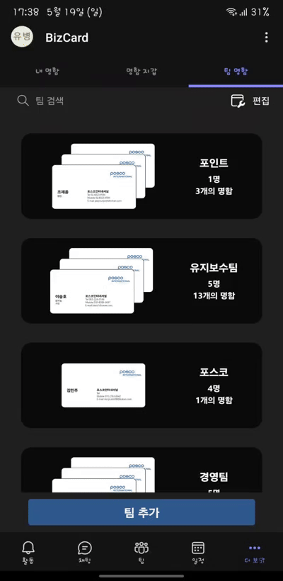 

---

팀 명함에서 개인의 명함지갑으로 공유하기

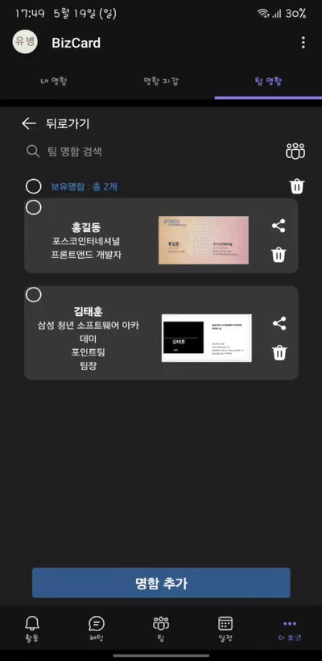 

---

개인 명함 지갑에서 팀 명함지갑으로 공유하기

팀 기능을 통해 원하는 팀에 명함을 공유하거나 등록하는 방법을 통해 간편하게 다양한 명함을 공유할 수 있습니다.
또한 팀 명함지갑과 개인의 명함지갑간 명함의 공유도 가능해 팀의 명함을 개인에게 추가하거나, 개인이 가지고 있는 명함을 팀원들에게 공유할 수 있습니다.

---

**5️⃣ 링크를 통한 명함 공유**

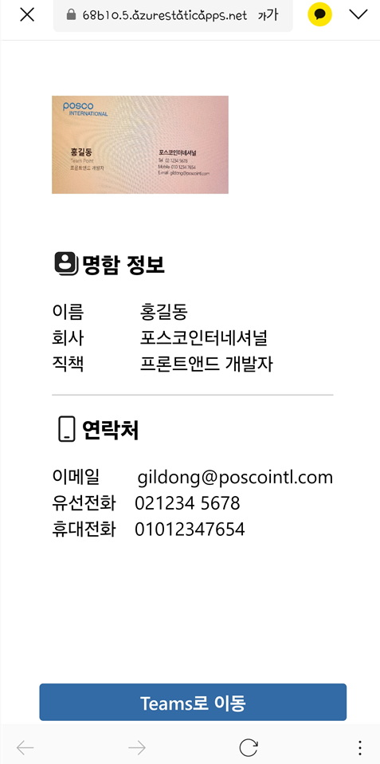

링크를 통해 자신의 명함 혹은 저장된 타인의 명함을 쉽게 공유할 수 있습니다.
해당 링크는 Teams를 사용하지 않더라도 명함의 정보를 확인 할 수 있는 페이지를 제공합니다.

---

**6️⃣ 엑셀 파일을 통한 내보내기 및 불러오기**

- pc Teams에서 지원되는 기능입니다.

`명함 내보내기`

| 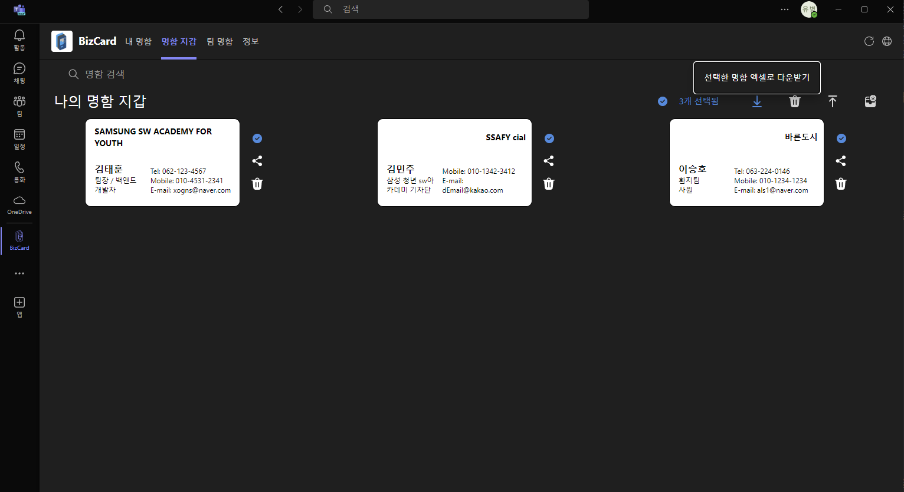 | 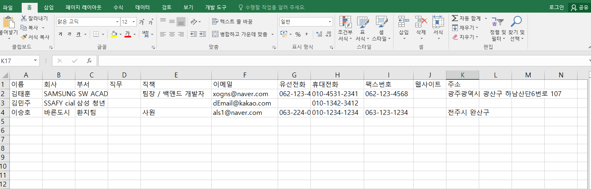 |
| --------------------------------------------------- | ---------------------------------------------------- |

`명함 불러오기`
||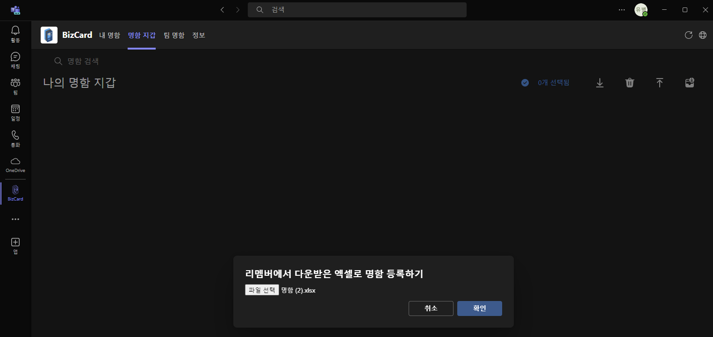|
|--|--|

다른 앱에서 내보낸 명함 정보를 손쉽게 **BizCard**에 엑셀 파일을 통해 등록할 수 있습니다.

---

**7️⃣ 반응형 App 제공**

PC,모바일 등 Teams를 이용 가능한 어떤 기기에서든 BizCard의 서비스를 이용할 수 있습니다.

## 🛠️ 기술 스택

### Frontend

|  |  |  |  |
| ------------------------------------------------------------------------------------------------------------- | ------------------------------------------------------------------------------------------------------------------------ | ------------------------------------------------------------------------------------------------------------------------- | --------------------------------------------------------------------------------------------------------------- |

### Backend

|  |  |  |
| --------------------------------------------------------------------------------------------------- | ------------------------------------------------------------------------------------------------------------ | ------------------------------------------------------------------------------------------------------ |

### DB

|  |
| ------------------------------------------------------------------------------------------------------ |

### Infra

|  |
| ---------------------------------------------------------------------------------------------------------- |

### Tools

|  |  |  |
| -------------------------------------------------------------------------------------------------------- | ------------------------------------------------------------------------------------------------------------ | --------------------------------------------------------------------------------------------------------------------------------- |

## 프로젝트 구성

### **아키텍쳐**

### **ERD**

- 중복되는 명함의 등록을 방지하기 위해 명함 테이블을 하나로 관리할 수 있도록 정규화했습니다.
- 명함 지갑에 필요한 명함과 팀 명함에서 필요한 명함을 하나의 테이블에서 관리하는 이유로 중간 테이블을 통한 다대다 관리를 적용했습니다.

### **API 명세서**

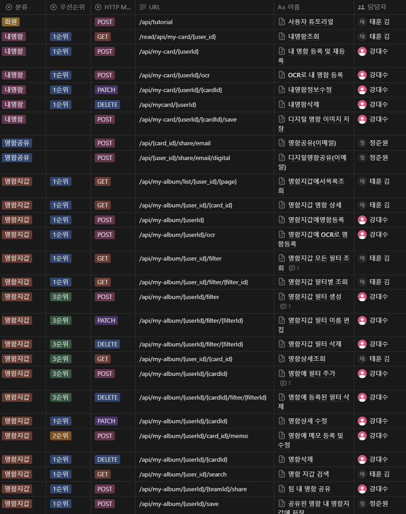
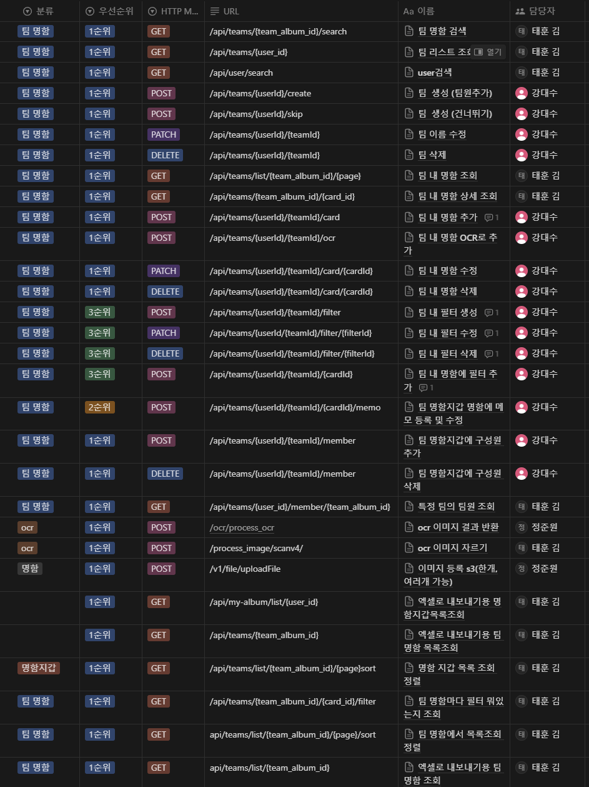
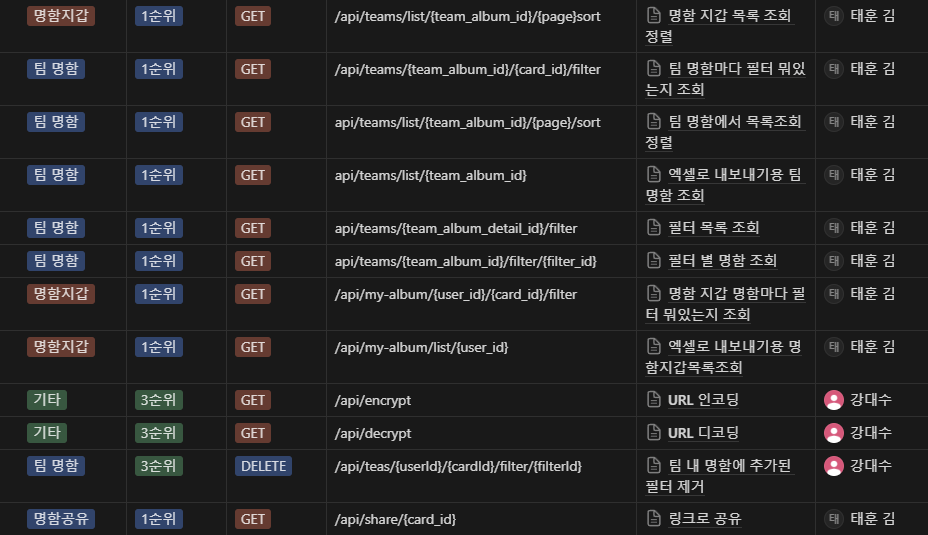

### **와이어프레임**

> 기업연계라는 특성을 바탕으로 포스코인터내셔널과 삼성 청년 SW 아카데미의 색상을 메인 색상으로 디자인했습니다.

모바일 환경

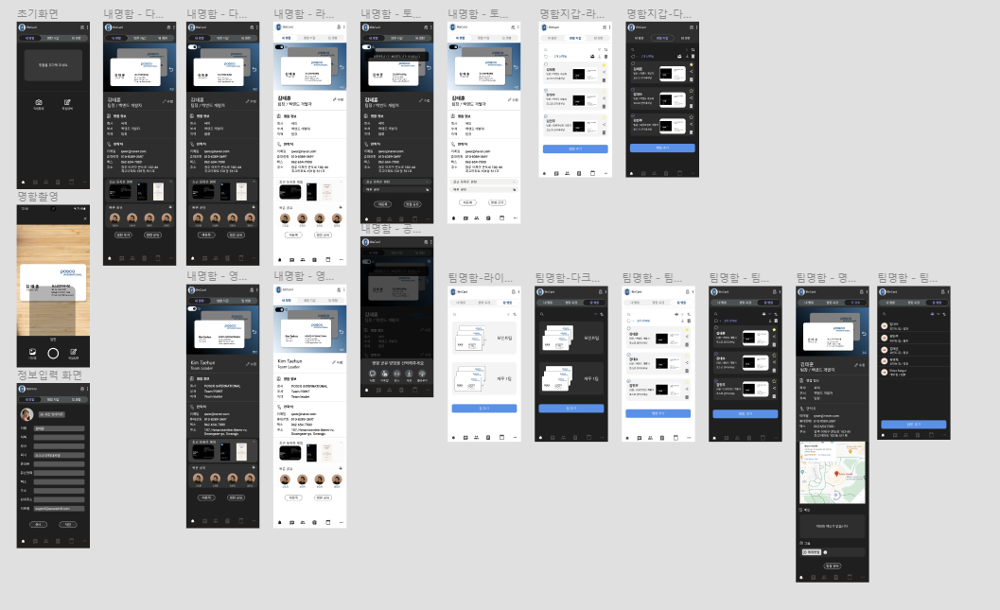

---

PC 환경

## 기대효과

- 명함 관리를 위해 별도의 앱을 사용하지 않고도 MS Teams 내에서 업무 흐름을 유지하며 명함을 공유할 수 있다
- 디지털 명함을 통해 실물 명함이 없는 상황이더라도 유연한 대처를 할 수 있다.

## 차별점

- MS Teams에 설치하는 앱으로, 팀 단위의 명함 관리가 가능합니다.
- 팀원, 개인간 간편한 명함 관리와 공유 기능을 통해 번거로운 명함 공유 과정을 단순화합니다.
- 회의 중 자신이 가지고 있는 명함을 확인하고 빠르게 공유할 수 있습니다.
- 링크를 통해 명함을 확인하거나 공유할 수 있습니다.

<!-- ## 영상 -->
<!-- - ucc -->
<!-- - 기능 영상 -->

## 화면

| 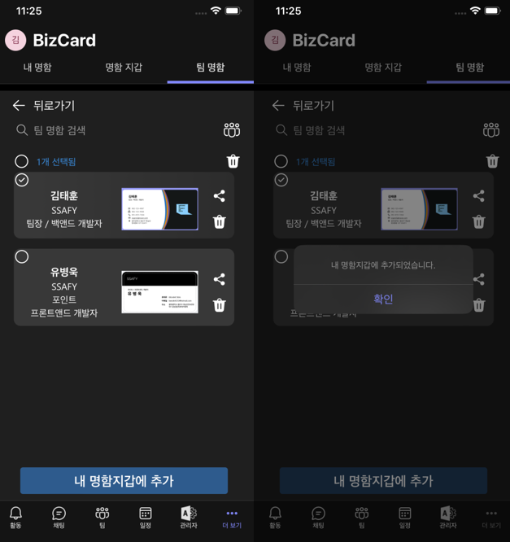 | 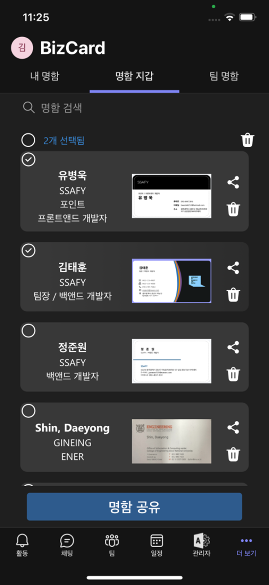 |
| -------------------------------------------------- | --------------------------------------------------- |

 

| 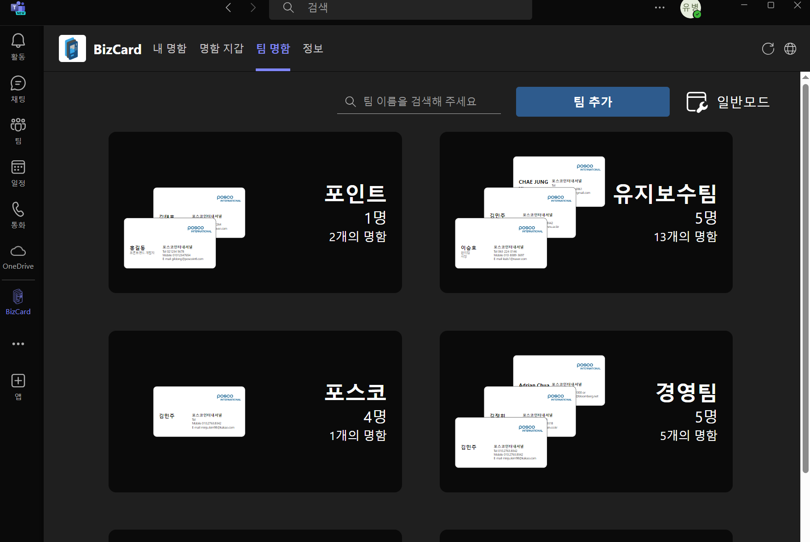 | 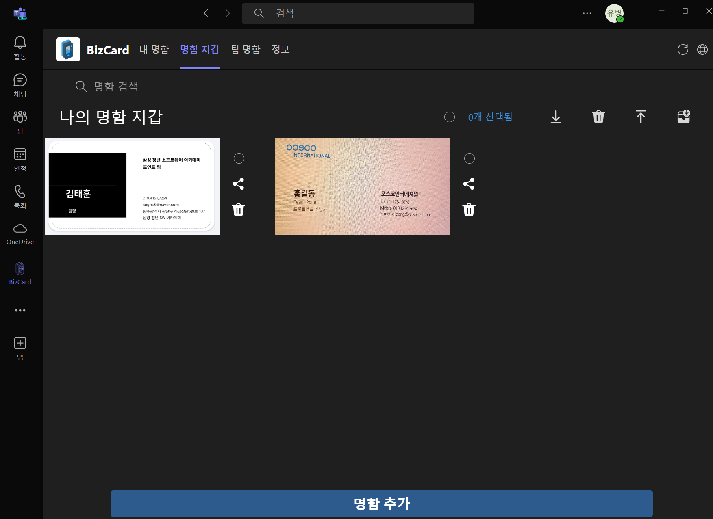 | 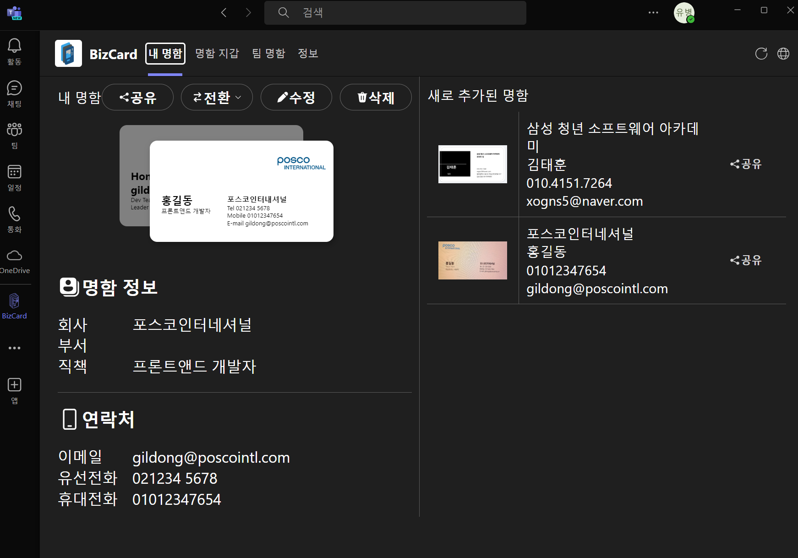 |
|:---:|:---:|:---:|
| PC 환경에서의 **팀 명함** | PC 환경에서의 명함 지갑 | PC 환경에서의 내 명함 |

## 실행 방법 / 포팅 메뉴얼

포팅메뉴얼은 [PortingManual 파일](./exec/포팅%20매뉴얼.md)을 참조해주시길 바랍니다.
